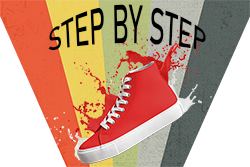

# StepByStep

The Fitness tracking application that adapts to you and help you reach your goals, one step at a time.

### Pre-requisite

To work with this project / source code, you will need to have Android Studio installed to run the project files.
A link is available below to install the software we used to develop this app.
You can also head to the "Installation" part of the README to get started with a pre-built apk for the latest stable version.

- Install [Android Studio](https://developer.android.com/studio)

### Installation

You can easily install this app on any mobile device running Android "Lollipop" or newer.
Compiled APK's are available in the "Releases" tab of the github project.

## Made with

* [Android Studio](https://developer.android.com/studio) - An IDE made for Android app development based on IntelliJ.

## Versions
**Last Stable Version :** [0.0.0-d](https://github.com/GBernard314/stepbystep/tags)
**Last Version :** [0.0.0-d](https://github.com/GBernard314/stepbystep/tags)

Full Versions list : [Click here to see](https://github.com/GBernard314/stepbystep/tags)

### Version Log  

**Nothing to see here for the moment**

## Authors

* **Pierre DESOOMER** [@PDesoomer](https://github.com/PDesoomer)
* **Agnès BOSSER** [@nanai2](https://github.com/nanai2)
* **Gabriel SMANIOTTO** [@Perifanos](https://github.com/Perifanos)
* **Inès BEN SLAMA** [@inesBenS](https://github.com/inesBenS)
* **Guillaume BERNARD** [@GBernard314](https://github.com/GBernard314)
* **Yanis ATTIA** [@yadev83](https://github.com/yadev83)

## License

This project is under the ``GPL v3.0`` license - see the file [LICENSE.md](LICENSE.md) for more information

